# 基于keepalived+GTID的半同步主从复制MySQL集群

* __项目环境： __7台服务器（2G，2核），centos7，mysql.5.7.41，mysqlrouter8.0.21，keepalived2.0.10，ansilble

* __项目描述：__ 本项目的目的是构建一个高可用的、能实现读写分离的MySQL集群，确保业务的稳定，能批量部署和管理整个集群。

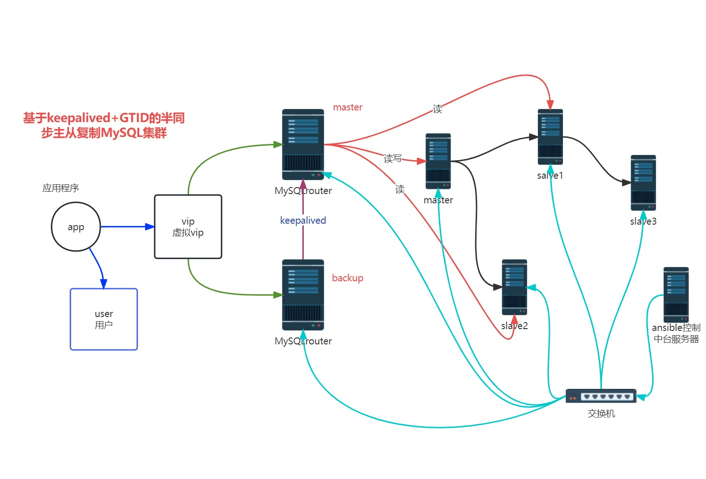

## 具体步骤：

### 准备工作

准备7台机器。

其中4台MySQL服务器，搭建主从复制的集群一个master服务器，2个slave服务器，一个延迟备份服务器。同时延迟备份服务器也可以充当异地备份服务器。

2台MySQLroute服务器，安装好keepalived软件，实现高可用的读写分离服务器。

一台ansible中控制服务器，实现对MySQL整个集群里的服务器进行批量管理。

#### 各服务器的IP地址：

master：192.168.232.147

slave1：192.168.232.141
slave2：192.168.232.148
slave3：192.168.232.149

ansible：192.168.232.144

router1：192.168.232.145
router2：192.168.232.146

### 一、配置master

#### 1、在master上安装配置半同步的插件

```
mysql>install plugin rpl_semi_sync_master soname 'semisync_master.so';
# 在master上设置超时时间为1秒
mysql>set global rpl_semi_sync_master_enabled = 1;
mysql>set global rpl_semi_sync_master_timeout = 1;
```

#### 2、修改配置文件

```
vim /etc/my.cnf
[mysqld]
innodb_buffer_pool_size = 1024M
character-set-server=utf8
# 开启二进制文件，设置id为1
log_bin
server_id = 1
# 设置超时时间为1秒
rpl_semi_sync_master_enabled=1
rpl_semi_sync_master_timeout=1000

```

修改配置文件之后要注意重启mysql服务

```
service mysqld restart
```

#### 3、在master上新建一个授权用户，给slave复制二进制日志

```
mysql>grant replication slave on *.* to 'chen'@'192.168.232.%' identified by 'Chen123#';
```

#### 4、导出master上的基础数据

```
mysqldump -uroot -p'Sanchuang123#' --all-databases --triggers --routines --events >all_db.SQL
# 将导出的数据传给ansible
scp all_db.SQL root@192.168.232.144:/root
```

### 二、配置slave

#### 1、在slave上安装配置半同步的插件

```
mysql>install plugin rpl_semi_sync_slave soname 'semisync_slave.so';
```

#### 2、修改slave的配置文件

设置半同步超时时间为1秒

```
mysql>set global rpl_semi_sync_slave_enabled=1;
```

```
vim /etc/my.cnf

[mysqld]
# 开启二进制日志，设置slave的id（不同机器的id不同）
log_bin
server_id = 2
# 在slave上设置半同步超时时间为1秒
rpl_semi_sync_slave_enabled=1
```

在master和slave上执行以下语句查看是否激活半同步

```
SELECT PLUGIN_NAME, PLUGIN_STATUS
FROM INFORMATION_SCHEMA.PLUGINS
WHERE PLUGIN_NAME LIKE '%semi%';

root@(none) 21:20  mysql>SELECT PLUGIN_NAME, PLUGIN_STATUS
    ->        FROM INFORMATION_SCHEMA.PLUGINS
    ->        WHERE PLUGIN_NAME LIKE '%semi%';
+----------------------+---------------+
| PLUGIN_NAME          | PLUGIN_STATUS |
+----------------------+---------------+
| rpl_semi_sync_master | ACTIVE        |
+----------------------+---------------+
1 row in set (0.03 sec)
```

#### 3、slave配置同步

```
mysql>stop slave;
mysql>reset slave all;
```

在slave上配置master info的信息

```
CHANGE MASTER TO MASTER_HOST='192.168.232.147',
 MASTER_USER='chen',
 MASTER_PASSWORD='Chen123#',
 MASTER_PORT=3306;
```

配置完成后开启服务，查看相关信息

```
mysql>start slave;
mysql>show slave status\G;
```

IO线程和SQL线程都已经开启，配置成功！

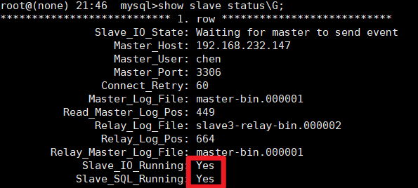

### 三、配置ansible

```
yum install epel-release -y
yum install ansible -y
```

#### 1、让ansible与所有的MySQL结点服务器建立免密通道

```
vim /etc/ansible/hosts
[db]
# 其他四台机器的IP
192.168.232.147
192.168.232.141
192.168.232.148
192.168.232.149
[dbslaves]
# 其他三台slave的IP
192.168.232.141
192.168.232.148
192.168.232.149
```

#### 2、生成RSA密钥对，并将公钥文件复制到目标主机上的对应文件中，以实现无密码登录

==复制公钥文件时需要其他服务都是开启的==

```
ssh-keygen -t rsa
ssh-copy-id -i /root/.ssh/id_rsa.pub root@（其他IP）
```

测试免密通道是否建立成功
``` 
ssh 'root@（其他IP）'
```

#### 3、拉取master的基础数据

```
scp root@192.168.232.147:/root/all_db.SQL .
```

#### 4、将拉取到的基础数据传到三台slave上

```
ansible -m copy -a "src=/root/all_db.SQL dest=/root" dbslaves
```

### 四、slave导入基础数据，完成基础数据同步

```
mysql -uroot -p'Sanchuang123#' <all_db.SQL
```

### 五、开启GTID功能

#### 1、在master配置文件/etc/my.cnf加上两行

```
[mysqld]
gtid-mode=ON
enforce-gtid-consistency=ON
```

#### 2、在slave配置文件/etc/my.cnf加上三行

```
[mysqld]
gtid-mode=ON
enforce-gtid-consistency=ON
# 自动更新
log_slave_updates=ON
```

#### 3、在slave配置master info的信息

```
mysql>reset master;
mysql>stop slave;
mysql>reset slave all;

mysql>CHANGE MASTER TO MASTER_HOST='192.168.232.147',
 MASTER_USER='chen',
 MASTER_PASSWORD='Chen123#',
 MASTER_PORT=3306,
 master_auto_position=1;
 
 mysql>start slave;
 mysql>show slave status\G;
```

最后显示IO进程和SQL进程都已经起来，并且GTID事务位置显示为1，GTID功能成功开启！

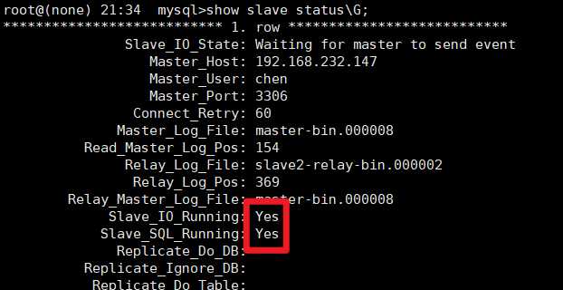

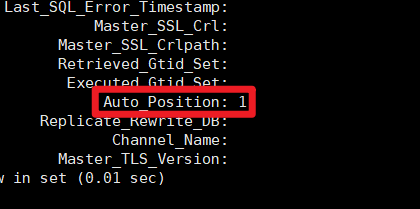

### 六、配置延迟备份服务器slave3，从slave1上拿二进制日志

#### 1、在slave1上安装配置半同步的插件

```
mysql>install plugin rpl_semi_sync_master soname 'semisync_master.so';
# 在master上设置超时时间为1秒
mysql>set global rpl_semi_sync_master_enabled = 1;
mysql>set global rpl_semi_sync_master_timeout = 1;
```

#### 2、修改slave1的配置文件

```
vim /etc/my.cnf
[mysqld]

# 设置超时时间为1秒
rpl_semi_sync_master_enabled=1
rpl_semi_sync_master_timeout=1000
```

slave1输入以下命令查看半同步是否激活成功

```
root@(none) 09:24  mysql>SELECT PLUGIN_NAME, PLUGIN_STATUS
    -> FROM INFORMATION_SCHEMA.PLUGINS
    -> WHERE PLUGIN_NAME LIKE '%semi%';
+----------------------+---------------+
| PLUGIN_NAME          | PLUGIN_STATUS |
+----------------------+---------------+
| rpl_semi_sync_master | ACTIVE        |
| rpl_semi_sync_slave  | ACTIVE        |
+----------------------+---------------+
2 rows in set (0.00 sec)

```

#### 3、在slave1上新建一个授权用户，给slave3复制二进制日志

```
mysql>grant replication slave on *.* to 'cheng'@'192.168.232.%' identified by 'Cheng123#';
```

#### 4、导出slave1上的基础数据

```
mysqldump -uroot -p'Sanchuang123#' --all-databases --triggers --routines --events >all_db.SQL
# 将导出的数据传给slave3
scp all_db.SQL root@192.168.232.149:/root
```

#### 5、slave3导入基础数据

```
mysql -uroot -p'Sanchuang123#' <all_db.SQL
```

#### 6、在slave3上清除master和slave的信息，并配置master info的信息

```
mysql>reset master;
mysql>stop slave;
mysql>reset slave all;

mysql>CHANGE MASTER TO
MASTER_HOST='192.168.232.141',
 MASTER_USER='cheng',
 MASTER_PASSWORD='Cheng123#',
 MASTER_PORT=3306,
 master_auto_position=1;
 
 mysql>start slave;
 mysql>show slave status\G;
```

出现以下信息就表示slave3到slave1的半同步配置成功

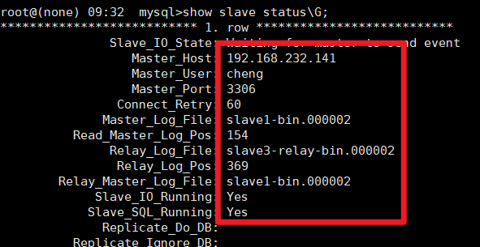

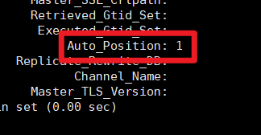

#### 7、在slave3上配置延迟备份

设置延迟备份时间为100秒

```
mysql>stop slave;
mysql>change master to master_delay = 100;
mysql>start slave;
mysql>show slave status\G;
```

看到以下值表示配置成功

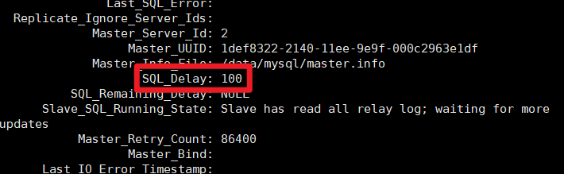

### 七、创建计划任务每天进行master数据库的备份

#### 1、在master和ansible服务器之间建立双向免密通道，方便同步数据

```
ssh-keygen -t rsa
ssh-copy-id -i /root/.ssh/id_rsa.pub root@192.168.232.144
```

#### 2、编写备份脚本

```
cat /backup/backup_alldb.sh
#!/bin/bash

mkdir -p /backup
mysqldump -uroot -p'Sanchuang123#' --all-databases --triggers --routines --events >/backup/$(date +%Y%m%d%H%M%S)_all_db.SQL
scp /backup/$$(date +%Y%m%d%H%M%S)_all_db.SQL 192.168.232.144:/backup
```

#### 4、创建计划任务

每天4点执行备份脚本

```
crontab -e
0 4 * * * bash /backup/backup_alldb.sh
```

### 八、在另外的服务器上安装部署mysqlrouter中间件软件，实现读写分离

#### 1、在浏览器上下载rpm软件

https://dev.mysql.com/get/Downloads/MySQL-Router/mysql-router-community-8.0.23-1.el7.x86_64.rpm

#### 2、将下载好的软件传入，安装

```
rpm -ivh mysql-router-community-8.0.23-1.el7.x86_64.rpm
```

#### 3、修改配置文件

```
cd /etc/mysqlrouter/
vim mysqlrouter.conf

[logger]
level = INFO

# read-only
[routing:slaves]
# 设置地址为0.0.0.0，以便于后面的vip实现
bind_address = 0.0.0.0:7001
destinations = (slave1的IP):3306,(slave2的IP):3306
mode = read-only
connect_timeout = 1
# write and read
[routing:masters]
bind_address = 0.0.0.0:7002
destinations = (master的IP):3306
mode = read-write
connect_timeout = 2
```

修改配置文件之后启动MySQL router服务

```
service mysqlrouter restart
```

#### 4、查看监听端口

```
yum install net-tools -y
netstat -anplut|grep mysql

[root@router1 mysqlrouter]# netstat -anplut|grep mysql
tcp        0      0 192.168.232.145:7001    0.0.0.0:*               LISTEN      18384/mysqlrouter   
tcp        0      0 192.168.232.145:7002    0.0.0.0:*               LISTEN      18384/mysqlrouter 
```

#### 5、在master上创建2个测试账号，一个是写的，一个是读的

```
grant all on *.* to 'chen-w'@'%' identified by 'Chen123#';
grant select on *.* to 'chen-r'@'%' identified by 'Chen123#';
```

#### 6、在客户端上测试读写分离的效果，使用两个账号

==注意关闭所有的防火墙==

```
systemctl stop firewalld
systemctl disable firewalld
```

测试

```
mysql -h (router的IP) -P 7001 -uchen-r -p'Chen123#'
mysql -h (router的IP) -P 7002 -uchen-w -p'Chen123#'
```

查看连接的IP

```
show processlist;
```

### 九、安装keepalived实现高可用

#### 1、在两台mysql router上安装keepalived软件

```
yum install keepalived -y
```

#### 2、修改配置文件

```
cd /etc/keepalived/
vim keepalived.conf

# 把virtual_server内容全部删除
# vrrp_strict 		注释掉这行
```

修改router1中的配置文件

```
vrrp_instance VI_1 { # 定义一个vrrp协议实例VI_1
	state MASTER 		# 做master角色
	interface ens33 	#指定监听网络的接口，其实就是vip绑定到那个接口上 
	virtual_router_id 80 	# 虚拟路由器id
	priority 200 		# 优先级 0~255
	advert_int 1 		# 宣告消息的时间间隔1s
	authentication {
		auth_type PASS 	# 密码认证 password
		auth_pass 1111 	# 具体密码
	}
	virtual_ipaddress { 	# vip 虚拟ip地址
		192.168.232.188  	# ping一下看能不能用
	}
}
```

修改router2中的配置文件

```
vrrp_instance VI_1 {
	state backup 			# 做备用角色
	interface ens33
	virtual_router_id 80
	priority 100
	advert_int 1
	authentication {
		auth_type PASS
		auth_pass 1111
	}
	virtual_ipaddress {
		192.168.232.188
	}
}
```

配置完成后刷新服务

```
service keepalived start
```

可以看到router1有配置的192.168.232.188这个vip，而router2没有

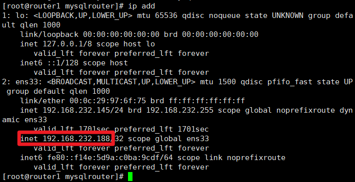

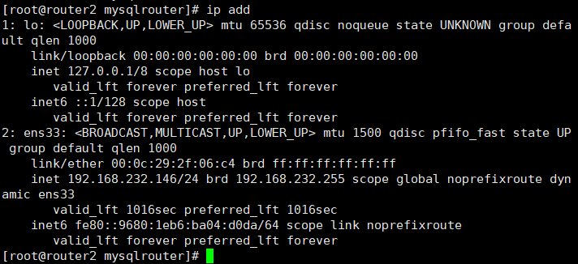

### 十、配置2个vrrp实例实现双vip的高可用功能

在router1配置文件里创建第二个实例，与router2互为主从

```
vrrp_instance VI_2 {
    state backup
    interface ens33
    virtual_router_id 26
    priority 100
    advert_int 1
    authentication {
        auth_type PASS
        auth_pass 1111
    }
    virtual_ipaddress {
        192.168.232.189
    }
}
```

在router2配置文件里创建第二个实例

```
vrrp_instance VI_2 {
    state MASTER
    interface ens33
    virtual_router_id 26
    priority 200
    advert_int 1
    authentication {
        auth_type PASS
        auth_pass 1111
    }
    virtual_ipaddress {
        192.168.232.189
    }
}
```

### 十一、性能测试

#### 1、在客户机上安装sysbench

```
yum install epel-release -y
yum install sysbench -y
```

#### 2、在master上建一个库供测试使用

```
mysql>create database test_db;
```

#### 3、在客户机上构造测试表和测试数据

性能测试的准备阶段，确保在压力测试期间使用的测试数据是合适的，能够充分模拟真实的数据库负载

```
sysbench --db-driver=mysql --time=300 \
--threads=10 --report-interval=1 \
--mysql-host=192.168.232.188 --mysql-port=7002 \
--mysql-user=chen-w --mysql-password=Chen123# \
--mysql-db=test_db --tables=10 --table_size=1000 \
oltp_read_write prepare
```

`--db-driver=mysql`：指定使用 MySQL 数据库驱动
`--time=300`：设置测试持续时间为300 秒，即测试将会在 300秒内进行
`--threads=10`：启动 100 个线程模拟并发访问，同时进行读写操作
`--report-interval=1`：设置每隔 1 秒输出一次测试进度报告，0表示仅输出最终报告结果，默认为0
`--mysql-host=192.168.232.188 --mysql-port=7002 --mysql-user=chen-w --mysql-password=Chen123# --mysql-db=test_db`：表示连接数据库的信息，这里连接的是router机器配置的vip和端口
`--tables=10 --table_size=1000`：在测试库中构造10个测试表，每个测试表中包含 1000 条测试数据，测试数据太大可能会导致mysql集群的磁盘耗尽，集群崩盘
`oltp_read_write`：测试模型，表示进行读写测试
`prepare`：表示进行准备阶段，创建测试用的表，并填充测试数据
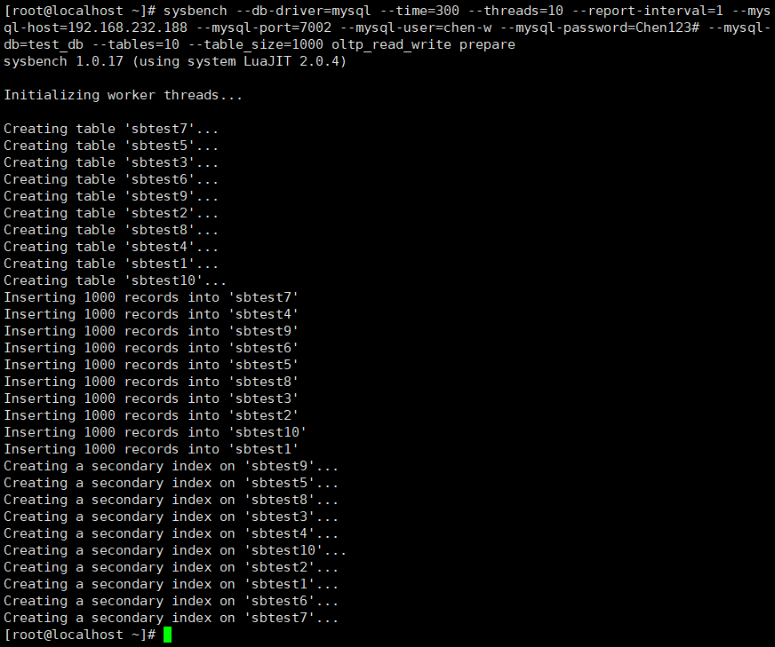

#### 4、测试数据库读写性能

使用并发的线程模拟数据库的读写操作，以测试数据库在高并发负载下的性能表现。压力测试会持续 300 秒，在测试过程中，会输出一些统计信息，如每秒事务数、每秒查询数、延迟等，以便分析数据库的性能状况

```
sysbench --db-driver=mysql --time=300 \
--threads=10 --report-interval=1 \
--mysql-host=192.168.232.188 --mysql-port=7002 \
--mysql-user=chen-w --mysql-password=Chen123# \
--mysql-db=test_db --tables=10 --table_size=1000 \
oltp_read_write run
```

`run`：表示运行阶段，即进行压力测试

每秒的测试结果：
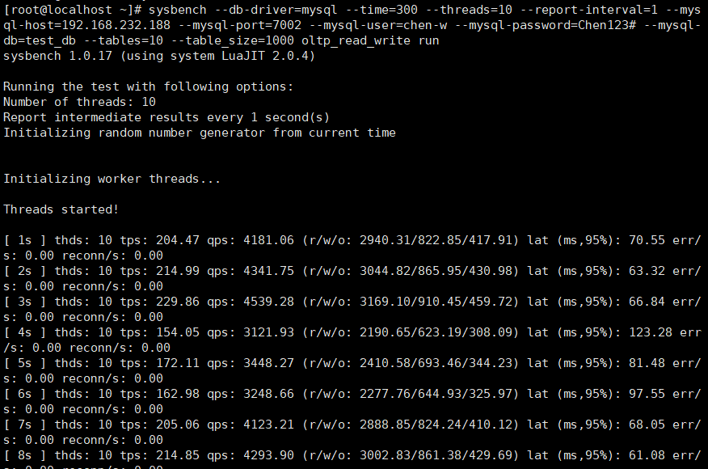

测试结果参数说明：

`thds： 10`：表示有10个线程在进行压力测试
`tps`：表示每秒执行了多少个事务（读写操作）
`qps`：表示每秒执行了多少个查询
`(r/w/o: 2940.31/822.85/417.91)`：每秒有2940.31个读操作，822.85个写操作，417.91个其他操作
`lat (ms,95%): 70.55`：表示95%的请求延迟都在70.55毫秒以下
`err/s: 0.00 reconn/s`: 0.00：表示每秒有0请求失败，发生0次网络重连

__总测试结果：__

```
sysbench --db-driver=mysql --time=60 --threads=10 \
--mysql-host=192.168.232.188 --mysql-port=7002 \
--mysql-user=chen-w --mysql-password=Chen123# \
--mysql-db=test_db --tables=10 --table_size=1000 \
oltp_read_write run
```

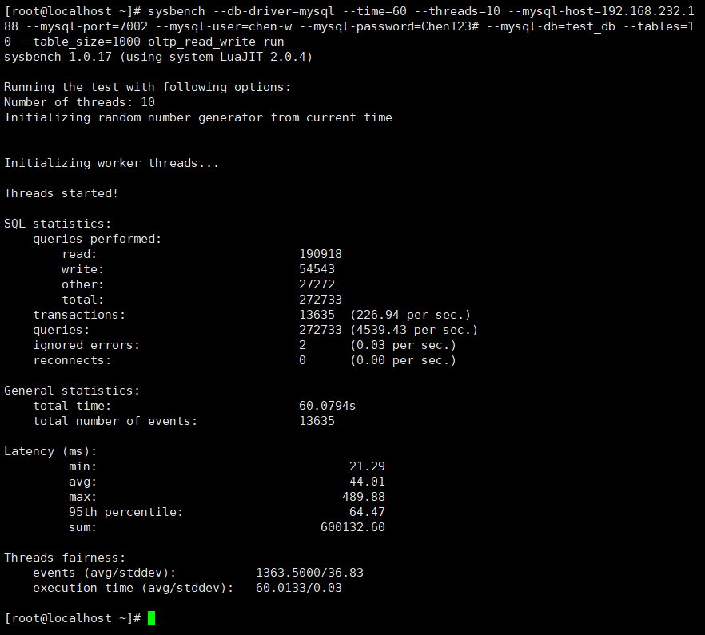

测试结果分析： 
SQL statistics 部分提供了执行的查询数量和事务数量等信息
General statistics 部分提供了总的测试时间和事件数量，一共执行了13635次，实际执行时间为60.0794s
Latency (ms) 部分显示了请求的延迟统计，包括最小、平均、最大延迟以及95% 响应时间等
Threads fairness 部分提供了事件和执行时间的平均值和标准差

#### 5、压力测试完成后，清除数据

```
sysbench --db-driver=mysql --time=300 \
--threads=10 --report-interval=1 \
--mysql-host=192.168.232.188 --mysql-port=7002 \
--mysql-user=chen-w --mysql-password=Chen123# \
--mysql-db=test_db --tables=10 --table_size=1000 \
oltp_read_write cleanup
```

### 十二、使用MHA实现自动故障切换

MHA（Master High Availability）是一个用于管理 MySQL 主从复制集群的工具，旨在提供高可用性和自动故障切换的解决方案。它的主要功能是监控主服务器（主节点）和备服务器（从节点）的状态，以便在主节点发生故障时自动进行故障切换，将备节点提升为新的主节点，从而实现数据库的高可用性。

#### 1、在ansible上编写主机清单

```
vim /etc/ansible/hosts

[mha_manager]
192.168.232.144
[mha_node]
192.168.232.147
192.168.232.141
192.168.232.148
```

#### 2、编写node和manager的安装脚本

一键安装mha node脚本

```
[root@mha_manager ~]# cat onekey_install_mha_node.sh 
#查看可以安装或者已安装的rpm包，并且作缓存
yum list

#下载epel源
yum install epel-release --nogpgcheck -y

#下载依赖包
yum install -y perl-DBD-MySQL \
perl-Config-Tiny \
perl-Log-Dispatch \
perl-Parallel-ForkManager \
perl-ExtUtils-CBuilder \
perl-ExtUtils-MakeMaker \
perl-CPAN
 
#软件包mha4mysql-node-0.58.tar.gz已经放入/root目录下，将其解压
cd ~
tar zxvf mha4mysql-node-0.58.tar.gz
cd mha4mysql-node-0.58
 
#编译安装
perl Makefile.PL
make && make install
```

mha manager安装脚本

```
#软件包mha4mysql-manager-0.58.tar.gz放入/root目录下
cd ~
tar zxvf mha4mysql-manager-0.58.tar.gz
cd mha4mysql-manager-0.58
 
#编译安装
perl Makefile.PL
make && make install
```

#### 3、编写playbook远程安装MHA

playbook内容：上传源码包到家目录下，调用本地脚本，远程安装部署mha相关软件环境

```
vim mha_install.yaml

- hosts: mha_node
  remote_user: root
  tasks: 
  - name: copy file
    copy: src=/root/mha4mysql-node-0.58.tar.gz dest=/root/
  - name: install mha_node
    script: /root/onekey_install_mha_node.sh
- hosts: mha_manager
  remote_user: root
  tasks:
  - name: copy file
    copy: src=/root/mha4mysql-manager-0.58.tar.gz dest=/root/
  - name: install mha_manager
    script: /root/onekey_install_mha_manager.sh 
```

执行playbook

```
ansible-playbook mha_install.yaml
```

#### 4、所有服务器之间建立免密通道

```
ssh-keygen
ssh-copy-id -i /root/.ssh/id_rsa.pub (其他主机IP)
```

#### 5、在Mysql的主从复制服务器里，配置MHA相关信息

所有mysql服务器（master、slave1、slave2）将mysql命令和mysqlbinlog二进制文件操作命令软链接到/usr/sbin，方便manager管理节点，因为/usr/sbin/ 目录下可以被直接调用

```
ln -s /usr/local/mysql/bin/mysql /usr/sbin/
ln -s /usr/local/mysql/bin/mysqlbinlog /usr/sbin/
```

#### 6、所有mysql服务器新建允许manager访问的授权用户mha，密码123456

```
mysql>grant all on *.* to 'mha'@'192.168.232.%' identified by '123456';
mysql>grant all on *.* to 'mha'@'192.168.2.147' identified by '123456';
mysql>grant all on *.* to 'mha'@'192.168.2.141' identified by '123456';
mysql>grant all on *.* to 'mha'@'192.168.2.148' identified by '123456';

mysql>select user,host from mysql.user;
```

#### 7、在MHA manager节点上配置好相关脚本、管理节点服务器

mha manager节点上复制相关脚本到/usr/local/bin下

```
cp -rp /root/mha4mysql-manager-0.58/samples/scripts/ /usr/local/bin/
cd /root/mha4mysql-manager-0.58/samples/scripts
ls

master_ip_failover  master_ip_online_change  power_manager  send_report
```

复制自动切换时vip管理的脚本到/usr/local/bin下

```
cp /usr/local/bin/scripts/master_ip_failover /usr/local/bin/
ls

master_ip_failover  master_ip_online_change  power_manager  send_report
```

修改master_ip_failover文件内容，配置vip(192.168.232.10)

**注意：注释只是提示用，编辑配置文件时最好不要加注释，否则很可能会出错**

```
cd /usr/local/bin/
>/usr/local/bin/master_ip_failover  #清空文件内容，复制以下内容
vim master_ip_failover 

#!/usr/bin/env perl
use strict;
use warnings FATAL => 'all';
 
use Getopt::Long;
 
my (
$command, $ssh_user, $orig_master_host, $orig_master_ip,
$orig_master_port, $new_master_host, $new_master_ip, $new_master_port
);

my $vip = '192.168.232.10';								#指定vip的地址，自己指定
my $brdc = '192.168.232.255';								#指定vip的广播地址
my $ifdev = 'ens33';										#指定vip绑定的网卡
my $key = '1';												#指定vip绑定的虚拟网卡序列号
my $ssh_start_vip = "/sbin/ifconfig ens33:$key $vip";		#代表此变量值为ifconfig ens33:1 192.168.232.10
my $ssh_stop_vip = "/sbin/ifconfig ens33:$key down";		#代表此变量值为ifconfig ens33:1 192.168.232.10 down
my $exit_code = 0;											#指定退出状态码为0
#my $ssh_start_vip = "/usr/sbin/ip addr add $vip/24 brd $brdc dev $ifdev label $ifdev:$key;/usr/sbin/arping -q -A -c 1 -I $ifdev $vip;iptables -F;";
#my $ssh_stop_vip = "/usr/sbin/ip addr del $vip/24 dev $ifdev label $ifdev:$key";

GetOptions(
'command=s' => \$command,
'ssh_user=s' => \$ssh_user,
'orig_master_host=s' => \$orig_master_host,
'orig_master_ip=s' => \$orig_master_ip,
'orig_master_port=i' => \$orig_master_port,
'new_master_host=s' => \$new_master_host,
'new_master_ip=s' => \$new_master_ip,
'new_master_port=i' => \$new_master_port,
);
 
exit &main();
 
sub main {
 
print "\n\nIN SCRIPT TEST====$ssh_stop_vip==$ssh_start_vip===\n\n";
 
if ( $command eq "stop" || $command eq "stopssh" ) {
 
my $exit_code = 1;
eval {
print "Disabling the VIP on old master: $orig_master_host \n";
&stop_vip();
$exit_code = 0;
};
if ($@) {
warn "Got Error: $@\n";
exit $exit_code;
}
exit $exit_code;
}
elsif ( $command eq "start" ) {
 
my $exit_code = 10;
eval {
print "Enabling the VIP - $vip on the new master - $new_master_host \n";
&start_vip();
$exit_code = 0;
};
if ($@) {
warn $@;
exit $exit_code;
}
exit $exit_code;
}
elsif ( $command eq "status" ) {
print "Checking the Status of the script.. OK \n";
exit 0;
}
else {
&usage();
exit 1;
}
}
sub start_vip() {
`ssh $ssh_user\@$new_master_host \" $ssh_start_vip \"`;
}
## A simple system call that disable the VIP on the old_master
sub stop_vip() {
`ssh $ssh_user\@$orig_master_host \" $ssh_stop_vip \"`;
}
 
sub usage {
print
"Usage: master_ip_failover --command=start|stop|stopssh|status --orig_master_host=host --orig_master_ip=ip --orig_master_port=port --new_master_host=host --new_master_ip=ip --new_master_port=port\n";
}

```

#### 8、创建 MHA 软件目录并复制配置文件

使用app1.cnf配置文件来管理 mysql 节点服务器，配置文件一般放在/etc/目录下

```
cd /usr/local/bin/
mkdir /etc/masterha
cp /root/mha4mysql-manager-0.58/samples/conf/app1.cnf /etc/masterha/
cd /etc/masterha/
>app1.cnf #清空原有内容
vim app1.cnf 
 
[server default]
manager_log=/var/log/masterha/app1/manager.log　　　　　  #manager日志
manager_workdir=/var/log/masterha/app1.log　　　　		#manager工作目录
master_binlog_dir=/data/mysql/　　　　　　　　 　#master保存binlog的位置，这里的路径要与master里配置的binlog的路径一致，以便MHA能找到
master_ip_failover_script=/usr/local/bin/master_ip_failover　          　#设置自动failover时候的切换脚本，也就是上面的那个脚本
master_ip_online_change_script=/usr/local/bin/master_ip_online_change　　#设置手动切换时候的切换脚本
user=mha					#设置监控用户mha
password=123456			#设置mysql中mha用户的密码，这个密码是前文中创建监控用户的那个密码
ping_interval=1				#设置监控主库，发送ping包的时间间隔1秒，默认是3秒，尝试三次没有回应的时候自动进行failover
remote_workdir=/tmp			#设置远端mysql在发生切换时binlog的保存位置
repl_user=chen			#设置复制用户的用户
repl_password=Chen123#		#设置复制用户的密码
report_script=/usr/local/send_report　　　　　#设置发生切换后发送的报警的脚本
secondary_check_script=/usr/local/bin/masterha_secondary_check -s 192.168.2.141 -s 192.168.2.148	#指定检查的从服务器IP地址
shutdown_script=""			#设置故障发生后关闭故障主机脚本（该脚本的主要作用是关闭主机防止发生脑裂,这里没有使用）
ssh_user=root				#设置ssh的登录用户名
 
[server1]
#master
hostname=192.168.232.147 
port=3306
 
[server2]
#slave1
hostname=192.168.232.141
port=3306
candidate_master=1
#设置为候选master，设置该参数以后，发生主从切换以后将会将此从库提升为主库，即使这个主库不是集群中最新的slave
 
check_repl_delay=0
#默认情况下如果一个slave落后master 超过100M的relay logs的话，MHA将不会选择该slave作为一个新的master， 因为对于这个slave的恢复需要花费很长时间；通过设置check_repl_delay=0，MHA触发切换在选择一个新的master的时候将会忽略复制延时，这个参数对于设置了candidate_master=1的主机非常有用，因为这个候选主在切换的过程中一定是新的master
 
[server3]
#slave2
hostname=192.168.232.148
port=3306
```

master服务器上手工开启vip

```
cd
ifconfig ens33:1 192.168.232.10/24
ip add
```

#### 8、测试

manager节点上测试ssh免密通道，如果正常最后会输出successfully

```
masterha_check_ssh -conf=/etc/masterha/app1.cnf
```

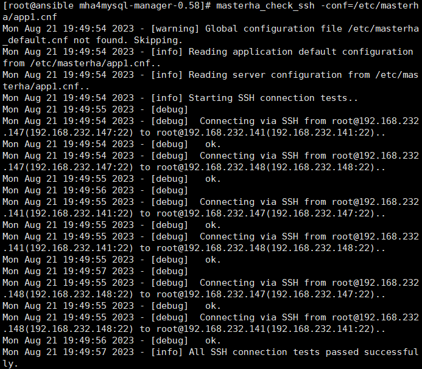

manager节点上测试mysql主从连接情况

```
masterha_check_repl -conf=/etc/masterha/app1.cnf
```


#### 9、manager节点后台开启MHA

```
mkdir -p /var/log/masterha/app1/
nohup masterha_manager --conf=/etc/masterha/app1.cnf --remove_dead_master_conf --ignore_last_failover < /dev/null > /var/log/masterha/app1/manager.log 2>&1 &
```

查看 MHA 状态，可以看到当前的 master 是 Mysql1 节点

```
masterha_check_status --conf=/etc/masterha/app1.cnf
```

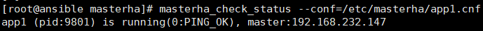

查看MHA日志，看到当前matser是192.168.2.150

```
cat /var/log/masterha/app1/manager.log | grep "current master"
```

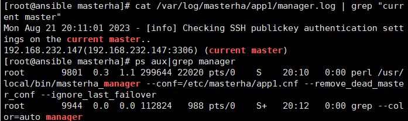

#### 10、故障转移效果测试，模拟matser宕机，指定slave1成为新的master

manager节点监控日志记录（实时监控）

```
tail -f /var/log/masterha/app1/manager.log
```

模拟master宕机，停掉master

```
service mysqld stop
```

这个时候看到vip已经飘移到slave1上了
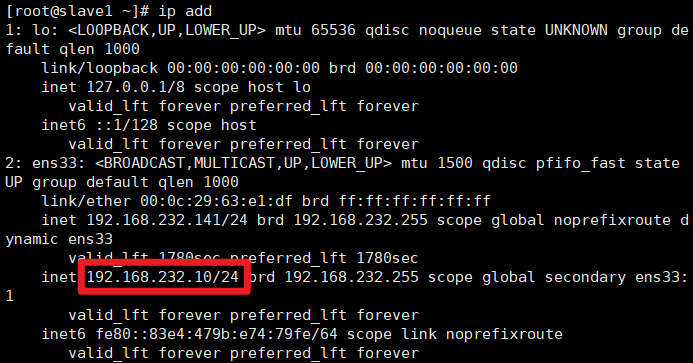

在slave2上看master_info的信息，主已经是slave1了
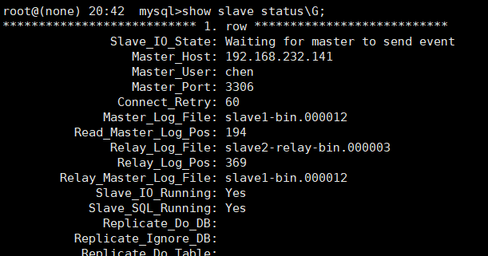

#### 11、故障修复

**如果原master服务器已经可以重新启动，将他变为slave服务器，主为slave1**

原master开启mysqld服务

```
service mysqld start
```

修复主从，原master修改master_info指向新的master（原slave1）

在master上进行操作

```
mysql>change master to master_host='192.168.232.141',master_user='chen',master_password='Chen123#',master_port=3306,master_auto_position=1;
mysql>start slave;
mysql>show slave status\G;
```

在 manager 节点上修改配置文件/etc/masterha/app1.cnf（再把这个记录添加进去，因为master宕机后原来的server1会被自动删除）

```
[server default]
manager_log=/var/log/masterha/app1/manager.log
manager_workdir=/var/log/masterha/app1
master_binlog_dir=/data/mysql/
master_ip_failover_script=/usr/local/bin/master_ip_failover
master_ip_online_change_script=/usr/local/bin/master_ip_online_change
password=123456
ping_interval=1
remote_workdir=/tmp
repl_password=Chen123#
repl_user=chen
secondary_check_script=/usr/local/bin/masterha_secondary_check -s 192.168.232.141 -s 192.168.232.148
shutdown_script=""
ssh_user=root
user=mha
 
[server1]
hostname=192.168.232.141   #原slave1的IP地址
port=3306
 
[server2]
candidate_master=1
check_repl_delay=0
hostname=192.168.232.147   #原master的IP地址
port=3306
 
[server3]
hostname=192.168.232.148   #原slave2的IP地址
port=3306 
```

重启MHA manager，检查此时的master

```
masterha_stop --conf=/etc/masterha/app1.cnf
nohup masterha_manager --conf=/etc/masterha/app1.cnf --remove_dead_master_conf --ignore_last_failover < /dev/null > /var/log/masterha/app1/manager.log 2>&1 &
masterha_check_status --conf=/etc/masterha/app1.cnf
```

